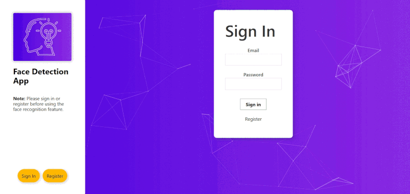
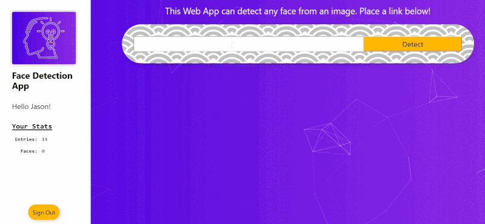

# Face Detection App (Front-end)
`Live:` https://devchia254-facedetection.herokuapp.com/



A web app that can detect multiple faces submitted from an image URL. This is the source code of the **Front-end**. To see the Back-end, [**click here**](https://github.com/devchia254/facedetection-api).

## Info
- The Front-end is created using the `create-react-app `boilerplate from [Facebook](https://github.com/facebook/create-react-app).
- This web app uses the face recognition feature from the [Clarifai API](https://www.clarifai.com/models/face-detection-image-recognition-model-a403429f2ddf4b49b307e318f00e528b-detection) but is stored in the back-end.
- The web app is not mobile responsive (yet!).


## Purpose
- Learn how to create Full Stack web app using React, Node.js and PostgreSQL.

## Features & Code Snippets
Below are some of the features and code extracts of this project.

### Multiple Face Recognition Feature
---


When faces are detected from the image submitted, they are recognized and calculated based on coordinates called "bounding boxes". These bounding boxes are then stored in an array. 

##### App.js:
```javascript
calculateFaceLocation = (data) => {

	const arrOfBoundingBoxes = []; // Stores an array of bounding box objects 
	const regions = data.outputs[0].data.regions; // Easy access to the bounding boxes once the faces has been detected from the image URL
	
	//Gets dimensions of the image used for detection
	const image = document.getElementById('inputimage');
	const width = Number(image.width);
	const height = Number(image.height);
	
	// Loops through a list of bounding boxes in the "region_info" as objects
	regions.forEach((region, i) => {
		const boundingBox = region.region_info.bounding_box;// Retrieve the coordinates of faces detected in the form of bounding boxes

		// Calculates the coordinates of the bounding boxes and stores them into an object, then pushes each object into an array
		arrOfBoundingBoxes.push(
			{
				leftCol: boundingBox.left_col * width,
				topRow: boundingBox.top_row * height,
				rightCol: width - (boundingBox.right_col * width),
				bottomRow: height - (boundingBox.bottom_row * height)
			}
		)
	});
	return arrOfBoundingBoxes; // returns array of bounding boxes for the function
}
```
##### FaceRecognition.js:
The FaceRecognition component uses the box `state` as a `props`. The box `state` is an empty array that contains the bounding boxes calculated from the `calculateFaceLocation` function.

```javascript
// Creates a new array of bounding box divs to enable multiple face detection
const listOfFaces = box.map((face, i) => {
	const { topRow, rightCol, bottomRow, leftCol } = face;
	
	return (
		<div className='bounding-box'
			key={i}
			style={
				{
				top: topRow,
				right: rightCol,
				bottom: bottomRow,
				left: leftCol
				}
			}
		>
		</div>
	)
});
```
### Connect to the Clarifai API from the Back-end
When the image URL gets submitted, the `onButtonSubmit` function accesses the server through the path '/imageUrl' to connect to the Clarifai API. The returning value of this function triggers the `calculateFaceLocation` to detect the bounding boxes then stores them in the box `state` through the `displayFaceBox` function.

```javascript
onButtonSubmit = () => {
  this.setState({imageUrl: this.state.input}); //Stores the input in the imageUrl state
	// Create a post request for calling on the Clarifai API from the Back-end when the imageURL has been submitted
  fetch('https://fast-sands-24633.herokuapp.com/imageurl', {
    method: 'post',
    headers: {'Content-Type': 'application/json'},
    body: JSON.stringify({
      input: this.state.input
    })
  })
    .then(response => response.json())
    .then(response => {
			// If there is a response, it retrieves the ID of the user who submitted an image then increments the total entry of image submitted by that user.
      if (response) {
        fetch('https://fast-sands-24633.herokuapp.com/image', {
          method: 'put',
          headers: {'Content-Type': 'application/json'},
          body: JSON.stringify({
            id: this.state.user.id
          })
        })
          .then(response => response.json())
          .then(count => {
            this.setState(Object.assign(this.state.user, { entries: count }))
          })
          .catch(console.log)
      }
      this.displayFaceBox(this.calculateFaceLocation(response))// Finally stores the bounding boxes objects into box state, once all above is parsed
    })
    .catch(err => console.log(err))
 }
```

## NPM Dev Packages:

`react` , `react-dom` and `react-scripts`, were initiated from the create-react-app command.

`tachyons` is a package for styling the site with greater ease.


```json
"dependencies": {

    "react": "^16.8.6",
    "react-dom": "^16.8.6",
    "react-particles-js": "^2.6.0",
    "react-scripts": "3.0.1",
    "react-tilt": "^0.1.4",
    "tachyons": "^4.11.1"

}
```
